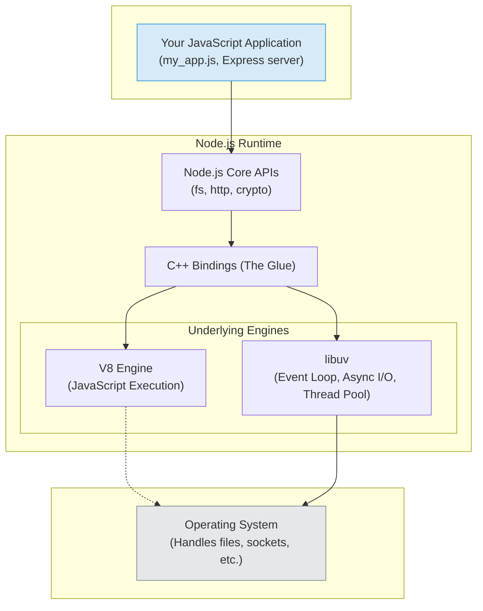
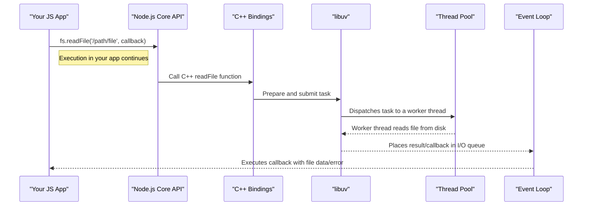

# What Node.js Actually Is

So, you're here to _really_ understand Node.js. Good.

Maybe you've used it for a while. You’ve built an API with Express, you’ve wrestled with `npm install`, and you’ve seen your fair share of `callback is not a function`. You know it’s "asynchronous" and "non-blocking," and you can write an `async` function in your sleep.

But there’s this nagging feeling, isn’t there? A sense that under the hood, there’s a whole world of machinery you’ve never quite seen. What _is_ the event loop, really? When people say Node is "single-threaded," what do they actually mean, and why does your server handle thousands of users at once? How does a JavaScript file, something that used to just run in a browser, suddenly have the power to write to files and open network sockets?

This chapter is our entry point into that engine room. We’re not just going to define Node.js. We’re going to dissect it. We’ll look at the historical accident that led to its creation, inspect the core components that make it tick, and understand the cultural phenomenon - the ecosystem - that grew around it.

My goal isn't just to give you facts. It's to give you a _mental model_. By the end of this, when you write `fs.readFile()`, I want you to see the journey that request takes: from your JavaScript, through the C++ bindings, into the libuv library, handed off to the operating system, and the response bubbling all the way back up through the event loop.

Before we dive in, I'm going to assume a few things about you. Don't worry, this isn't a test. It just helps us stay focused on the deep stuff.

| Prerequisite (≤5)                                | Why it matters / what to skim                                                                       |
| ------------------------------------------------ | --------------------------------------------------------------------------------------------------- |
| JavaScript `async/await` and Promises            | Our examples will use modern async syntax; a quick refresher is all you need if you're rusty.       |
| Basic Terminal & Shell Commands                  | We'll be running commands like `node`, `npm`, and simple performance tools (`curl`, `htop`).        |
| Familiarity with a web framework (e.g., Express) | Knowing the basics of building an API helps contextualize why Node's performance model matters.     |
| The concept of I/O (Input/Output)                | We'll talk a lot about file I/O and network I/O. Just know it means "talking to the outside world." |

If you’re solid on those, you’re ready. Let's get our hands dirty.

## TL;DR

For those who need the key takeaways right now and will read the details later:

Node.js is not a language, framework or library; it's a **runtime**. It's a program that executes your JavaScript code outside of a web browser. It's composed of three main parts:

1.  **The V8 JavaScript Engine.** The same high-performance engine from Google Chrome. It compiles your JS into native machine code.
2.  **The `libuv` Library.** A C library that provides the asynchronous, non-blocking I/O model. This is where the magic of the event loop and the worker thread pool happens. This is Node's secret weapon.
3.  **C++ Bindings & Node.js Core APIs.** The "glue" that connects your JavaScript (`require('fs')`) to the underlying C++ and `libuv` functionality, allowing you to access the filesystem, network, etc.

**Its core philosophy is non-blocking I/O.** Node was created to solve the problem of web servers getting stuck waiting for slow operations (like database queries or file reads). Instead of waiting, Node's event loop allows it to start an I/O operation, register a callback, and immediately move on to serving other requests. This makes it incredibly efficient at handling many concurrent connections with minimal memory.

**It's "single-threaded" in a specific way.** Your JavaScript code runs on a single main thread. You don't have to worry about locks or race conditions in your application logic. However, for heavy lifting (some file I/O, crypto, etc.), `libuv` maintains a small pool of background threads. So, while your code sees one thread, Node uses a few threads under the hood to avoid blocking.

**The ecosystem is as important as the runtime.** Node's core is intentionally minimal. Its power comes from **npm** (Node Package Manager), the largest software registry in the world. This culture of small, reusable modules allows for rapid development but also introduces challenges like dependency management and supply chain security (as we'll see with the `left-pad` incident).

**Your mental model should be that of an "evented" system.** Think of Node as a hyper-efficient event coordinator. It takes requests, delegates slow tasks to the OS or its thread pool, and keeps a list of "things to do when those tasks are done." It spends almost no time waiting and almost all its time working or delegating.

> [!WARNING]
>
> Your JavaScript application logic runs on a single main thread which avoids many traditional thread-locking problems, but you still must think about concurrent access to shared state. Asynchronous callbacks, multiple Node processes, worker_threads, native addons, and any use of shared memory (e.g., SharedArrayBuffer) introduce concurrency concerns and potential race conditions - design for immutable state, atomic updates, or use appropriate synchronization when needed. Don't worry, we're going to cover each one of those in greater details.

---

## **The Runtime - A Guided Tour Under the Hood**

### Why Blocking I/O Was a Party Everyone Hated

To understand _why_ Node.js is the way it is, you have to go back to 2009. The web server landscape was dominated by giants like Apache. If you were building a web application, the standard model was something like this:

1.  A user's request comes in.
2.  The server (Apache) dedicates a thread (or a whole process) to handle that request.
3.  Your application code runs on that thread.
4.  If your code needs to do something slow - like query a database, read a file from disk, or call another API - that thread just… stops. It sits there, blocked, holding onto memory and CPU resources, waiting for the slow thing to finish.
5.  Once the slow thing is done, the thread wakes up, finishes generating the response, sends it back, and is finally free to handle another request.

This model is simple to reason about. Each request is a neat, linear sequence of steps. But it has a fatal flaw.

> [!NOTE]
>
> It's important to note that this describes the classic model; modern multi-threaded servers and language runtimes have evolved significantly with hybrid event-driven/threaded models and more efficient threading implementations to mitigate these original scaling issues.

Imagine a popular coffee shop. Their model is one barista per customer, from start to finish. You walk in, Barista A takes your order, walks over to the machine, grinds the beans, pulls the espresso shot, steams the milk, and finally gives you your latte. During that entire five-minute process, Barista A is _your_ barista. They can't help anyone else. If ten people walk in at once, you need ten baristas and ten espresso machines. If a thousand people walk in? You have a big, expensive problem.

This is the "thread-per-request" model of old web servers. Threads are expensive. They consume memory (for their stack) and CPU time (for context switching). Handling thousands of concurrent users meant running thousands of threads, which was incredibly inefficient. This was known as the [C10k problem](http://www.kegel.com/c10k.html) - the challenge of handling ten thousand concurrent connections on a single server.

**The "Aha!" Moment**

A developer named Ryan Dahl was looking at this problem and thought it was fundamentally broken. He saw that the slowest parts of any web application were always the I/O operations - waiting for the network, waiting for the disk. The CPU itself was often just sitting idle while the thread was blocked.

He looked at how high-performance servers like Nginx solved this: with an **event-driven, non-blocking architecture**. Instead of dedicating a worker to each customer, what if you had one super-fast barista (the event loop) who just took orders?

1.  Customer 1 wants a latte. The barista writes the order on a ticket, hands it to a machine (the OS/kernel), and immediately turns to the next customer.
2.  Customer 2 wants a drip coffee. The barista writes the order, hands it to another machine, and is instantly available again.

The barista never waits. They just process events ("new order") and delegate the slow work. When a drink is ready, a bell rings (an event is emitted). The barista grabs the finished drink, hands it to the right customer, and moves on.

This is the core idea of Node.js.

Dahl saw that JavaScript, a language born in the browser, was perfectly suited for this model. Why? Because browser-based JavaScript is already event-driven. You don't write code that says `wait for 5 seconds for the user to click this button`. You write `button.addEventListener('click', function() { ... })`. You register a callback for an event and let the environment (the browser) notify you when it happens.

So, he took the fastest JavaScript engine he could find - Google's open-source V8 engine from the Chrome browser - and combined it with a new C library he wrote (which would eventually be replaced by the more robust `libuv`) to handle this asynchronous I/O. He created a runtime environment that could execute JavaScript on a server, but with this powerful, event-driven, non-blocking I/O model at its core.

> [!NOTE]
>
> Early Node prototypes relied on existing event libraries (libev/libeio) for the kernel integration; later the project transitioned to libuv - a cross-platform C library (primarily maintained by contributors such as Ben Noordhuis and others) that unified event loop, async filesystem, threadpool, and platform abstractions.

He presented this new creation, "Node.js," at a conference in 2009. The demo was simple but profound. He showed a server that could handle a huge number of concurrent connections with a tiny memory footprint, all because it never waited. It was a direct solution to the C10k problem, and it changed the way a generation of developers thought about building web services.

This history is crucial because it's baked into Node's DNA. Every design decision, every API, is built around this central premise: **never block the main thread**. It’s why the default file reading method, `fs.readFile`, takes a callback. It’s why you use Promises and `async/await`. You are always, always telling Node, "Hey, go do this slow thing, and just let me know when you're done. I've got other work to do."

> [!NOTE]
>
> Historically `fs.readFile` used callbacks; modern code should prefer `fs.promises` with async/await or streaming APIs when appropriate.

### The Core Components - V8, libuv, and the Glue

When you type `node my_app.js` and hit enter, you're not just running a JavaScript interpreter. You are starting a complex, finely-tuned piece of software. Let's peel back the layers.

At a high level, the Node.js architecture looks something like this:



_The layers of the Node.js runtime, from your code down to the OS._

> [!NOTE]
>
> Diagram is simplified: exact internals differ by API and platform - e.g. networking uses kernel readiness APIs, some filesystem/DNS calls are handled by libuv’s threadpool, and libuv may use different kernel features (epoll/kqueue/IOCP/io_uring) depending on platform and libuv version.

Let's break down each major component.

**V8: The JavaScript Engine**

This is the piece that most people know about. V8 is Google's open-source, high-performance JavaScript and WebAssembly engine, written in C++. It's the engine that powers Google Chrome. When Node.js started, using V8 was a brilliant move. It meant Node got a world-class, incredibly fast, and constantly improving JS engine for free.

But what does an "engine" actually do?

It doesn't just read your JavaScript line by line. It compiles it into highly-optimized native machine code. This process is called Just-In-Time (JIT) compilation.

**V8's Compilation Pipeline:** When V8 sees your JS code, it first uses a baseline compiler called **Ignition** to quickly turn it into bytecode. As your code runs, V8's profiler watches for "hot" functions - code that gets executed frequently. These hot functions are then passed to the optimizing compiler, **TurboFan**, which makes assumptions about your code (e.g., "this variable will always be a number") to generate blazing-fast machine code. If those assumptions ever prove false, V8 performs a "de-optimization" and falls back to the slower bytecode.
_(We'll do a much deeper dive into V8 internals and how to write optimization-friendly code in **Chapter 21**.)_

For now, the key takeaway is this: **V8 is what makes JavaScript fast enough for the server.** It takes a dynamic, interpreted language and gives it performance that can compete with more traditional server-side languages.

But V8 knows nothing about files, networks, or timers. It's a pure JavaScript engine. If you tried to run `require('fs')` inside a plain V8 instance, it would throw an error. It lives in a sandbox. To do anything useful on a server, V8 needs help.

**libuv**

This is the unsung hero of Node.js. `libuv` is a C library, originally written for Node.js, that provides the core asynchronous, event-driven functionality. It's the component that makes Node... well, _Node_.

Its main responsibilities are:

1. **The Event Loop.** This is the central mechanism. It's an endless loop that processes events from a queue. When you call `setTimeout`, `fs.readFile`, or `http.createServer`, you are essentially registering an event handler. The loop continuously asks the operating system, "Has anything happened with the things I'm waiting for?" (e.g., "Has that file finished reading?" "Has a new connection come in on this socket?"). When the OS says yes, the event loop takes the corresponding callback function from your code and executes it. We will dissect the event loop's phases in detail later, but for now, think of it as the tireless coordinator.

2. **Asynchronous I/O.** `libuv` abstracts the non-blocking I/O capabilities of the underlying operating system. On Linux, it uses `epoll`. On macOS/BSD, it uses `kqueue`. On Windows, it uses `IOCP` (I/O Completion Ports). You, the Node developer, don't have to care about any of this. You just write JavaScript, and `libuv` picks the best strategy for the platform it's running on to ensure I/O operations don't block the main thread.

3. **The Thread Pool.** Wait, I thought Node was single-threaded? Here's the most common point of confusion. Your JavaScript code runs on a single thread (the event loop thread). But some operations can't be done asynchronously by the OS in a non-blocking way. If these ran on the main thread, they would block the event loop, defeating the entire purpose of Node. This includes most file system APIs and CPU-intensive tasks like in the `crypto` and `zlib` modules.

   To solve this, `libuv` maintains a small, fixed-size **thread pool** (defaulting to 4 threads, but configurable via `UV_THREADPOOL_SIZE` before the pool is created; max ≈ `1024`). When you call a function that lacks a non-blocking equivalent at the OS level (like `fs.readFile`), `libuv` dispatches the work to its thread pool. Critically, network I/O is handled directly by the OS's non-blocking mechanisms (like epoll, kqueue, IOCP) and does _not_ use the thread pool, allowing a single thread to handle tens of thousands of concurrent connections.

   > [!NOTE]
   >
   > Most network socket I/O is handled via the OS’s non-blocking I/O facilities (epoll/kqueue/IOCP) and doesn’t use the libuv worker pool. Exceptions exist: hostname lookups (e.g. dns.lookup which uses getaddrinfo) and many filesystem operations are offloaded to the libuv threadpool - those tasks do consume worker threads.

   Once a thread in the pool finishes its task, it informs the event loop, which then executes your JavaScript callback with the result.

   So, Node.js _is_ single-threaded from your perspective, but it uses a few threads under the hood to handle specific types of work. This is a crucial distinction.
   _(We dive deep into `libuv`'s internals, the event loop phases, and the thread pool in **Chapter 23**.)_

**C++ Bindings & Node.js Core APIs: The Bridge**

So we have V8 (for running JS) and `libuv` (for async I/O). How do they talk to each other?

That's the job of the C++ bindings.

When you write `const fs = require('fs');`, you are not getting a pure JavaScript object. You're getting a JavaScript module that has "bindings" to underlying C++ code. When you call `fs.readFile('/path/to/file', callback)`, the following sequence happens:



1.  The JavaScript `readFile` function in Node's core `fs` module is called.
2.  This function calls down into a C++ function via the bindings.
3.  The C++ code prepares the request and then passes it to `libuv`, saying "please read this file."
4.  `libuv` gets the request and submits it to its thread pool for execution.
5.  Crucially, your JavaScript code continues executing immediately. The `readFile` call has returned `undefined`.
6.  Sometime later, a thread in the pool finishes reading the file. It informs `libuv` of the completion.
7.  `libuv` then places the result and the associated callback into a queue for the event loop to process.
8.  During a future tick of the event loop, it sees the completed job in the queue and executes the original JavaScript callback you provided, passing in the data or error.

This bridge is what makes Node.js a cohesive runtime. It exposes the power of low-level libraries like `libuv` through a clean, easy-to-use JavaScript API. The `http`, `crypto`, `path`, and other core modules are all part of this layer.

### Let's See It in Action - A Tiny Measurement Experiment

Theory is great, but seeing is believing. Let's demonstrate the profound difference between a blocking and a non-blocking I/O model with a simple experiment.

We will create two tiny web servers:

1.  **A Python server.** We'll use Flask, a popular web framework. To simulate a slow database query or API call, we'll make it sleep for 2 seconds on every request. This is a classic **blocking** operation.

    > [!IMPORTANT]
    >
    > The example uses Flask’s built-in development server (single-threaded) to illustrate blocking; you do not use the dev server in production. Production Python services typically run under a WSGI/ASGI server (Gunicorn, uWSGI, or uvicorn) with multiple workers or async event loops - which change the concurrency model. Thus the demo only shows a simple contrast, not a blanket statement about Python’s capabilities.

2.  **A Node.js server.** We'll use the built-in `http` module. To simulate the same slow operation, we'll use `setTimeout` for 2 seconds before responding. This is a **non-blocking** operation.

Then, we'll hit both servers with 10 concurrent requests and observe the behavior.

**The Blocking Server (Python/Flask)**

First, make sure you have Python and Flask installed.
`pip install Flask`

Save this code as `blocking_server.py`:

```python
import time
from flask import Flask

app = Flask(__name__)

@app.route("/")
def hello_world():
    print("Request received. Starting 2-second 'work'...")
    time.sleep(2)  # This BLOCKS the entire process!
    print("Work finished. Sending response.")
    return "<p>Hello from the blocking server!</p>"

if __name__ == '__main__':
    # Flask's dev server is single-threaded by default
    app.run(port=5000, threaded=False)
```

This server is designed to be naive. The `time.sleep(2)` call completely freezes the server. It can do absolutely nothing else until those two seconds are up.

Run it: `python blocking_server.py`

**The Non-Blocking Server (Node.js)**

Save this code as `non_blocking_server.js`:

```js twoslash
// @noErrors
import http from "http";

const server = http.createServer((req, res) => {
  // @log: Request received. Scheduling 2-second 'work'...
  console.log("Request received. Scheduling 2-second 'work'...");

  // This is NON-BLOCKING. It schedules the work and returns immediately.
  setTimeout(() => {
    // @log: Work finished. Sending response.
    console.log("Work finished. Sending response.");
    res.writeHead(200, { "Content-Type": "text/html" });
    res.end("<p>Hello from the non-blocking server!</p>");
  }, 2000);
});

server.listen(5001, () => {
  // @log: Server running on http://localhost:5001/
  console.log("Server running on http://localhost:5001/");
});
```

> [!NOTE]
>
> It is crucial to note that setTimeout represents a 'perfectly idle' wait, consuming no system resources. While this experiment brilliantly demonstrates the non-blocking nature of the event loop, a real-world application handling 10 concurrent database queries would still open 10 sockets and use memory for each connection's I/O buffers. The magic of Node.js is not that it makes I/O work free, but that it prevents the main thread from being blocked while that work is in flight.

> [!IMPORTANT]
>
> A timer schedules a callback for a future turn of the event loop; it is lightweight compared to CPU work but still allocates a handle and can keep the process alive (unless you call .unref() on the timer). Timers are not free - creating large numbers of timers or relying on timers as a concurrency primitive can increase memory and scheduling overhead.

Here, `setTimeout` doesn't pause execution. It tells the Node.js runtime, "In about 2000 milliseconds, please run this function." The main thread is immediately freed up to handle more incoming requests.

Run it: `node non_blocking_server.js`

**The Test**

Now, let's use a simple command-line tool, `curl`, to simulate 10 users hitting our servers at roughly the same time. Open a new terminal.

First, let's test the **blocking server**. Run these 10 `curl` commands in quick succession. The `&` makes each command run in the background. The `time` command will show us the total real time it took.

```bash
time ( \
  curl http://localhost:5000/ & \
  curl http://localhost:5000/ & \
  curl http://localhost:5000/ & \
  curl http://localhost:5000/ & \
  curl http://localhost:5000/ & \
  curl http://localhost:5000/ & \
  curl http://localhost:5000/ & \
  curl http://localhost:5000/ & \
  curl http://localhost:5000/ & \
  curl http://localhost:5000/ \
)
```

**Observation (Blocking Server):**

Look at the console output of `blocking_server.py`. You'll see something like this:

```
Request received. Starting 2-second 'work'...
Work finished. Sending response.
Request received. Starting 2-second 'work'...
Work finished. Sending response.
... (and so on, 10 times) ...
```

Notice the sequential nature. It processes one request _completely_ before even _starting_ the next.

The total time reported by the `time` command will be **approximately 20 seconds** (10 requests \* 2 seconds/request).

Now, let's test the **non-blocking server**.

```bash
time ( \
  curl http://localhost:5001/ & \
  curl http://localhost:5001/ & \
  curl http://localhost:5001/ & \
  curl http://localhost:5001/ & \
  curl http://localhost:5001/ & \
  curl http://localhost:5001/ & \
  curl http://localhost:5001/ & \
  curl http://localhost:5001/ & \
  curl http://localhost:5001/ & \
  curl http://localhost:5001/ \
)
```

**Observation (Non-Blocking Server):**

Look at the console output of `non_blocking_server.js`. You'll see something dramatically different:

```
Request received. Scheduling 2-second 'work'...
Request received. Scheduling 2-second 'work'...
Request received. Scheduling 2-second 'work'...
... (10 times, almost instantly) ...

Work finished. Sending response.
Work finished. Sending response.
Work finished. Sending response.
... (10 times, about 2 seconds after the first batch) ...
```

The server accepted _all 10 requests_ immediately, scheduled all 10 timeouts, and then, about two seconds later, all 10 timers fired and sent their responses.

The total time reported by the `time` command will be **just over 2 seconds**.

This is it. This is the magic. The Node server handled 10 concurrent "slow" operations in the time it took the Python server to handle just one. It achieved this concurrency not with 10 threads, but with one single, efficient event loop. If you were to check the process list while this is running (using a tool like `htop` or `ps`), you'd see a single `node` process with a tiny memory footprint, happily juggling all the requests at once. The blocking server, by contrast, would be completely saturated by a single request.

This simple experiment is the most important mental model you can have for Node.js performance.

---

## **The Ecosystem**

You cannot talk about Node.js without talking about its ecosystem. The runtime itself is powerful, but it's just a foundation. The true force of Node comes from the community and the universe of open-source packages built on top of it.

If Node.js is the engine, then **npm** is the factory that produces every conceivable part you might need, from tiny screws to entire transmissions.

### npm - The World's Biggest (and Sometimes Loudest) Toybox

When Node.js first came out, there was no standard way to share code. If you wanted to use someone's library, you'd probably copy-paste it or use a git submodule. It was messy.

In 2010, Isaac Z. Schlueter created **npm** (Node Package Manager). It was a simple command-line tool to download and manage dependencies for Node projects. It was bundled with Node.js starting in 2011, and this decision changed everything.

It made sharing and reusing code ridiculously easy. Had a useful function? `npm publish`. Needed a web framework? `npm install express`. This ease of use, combined with the growing popularity of Node, led to an explosion of packages.

The philosophy that emerged was heavily influenced by the Unix philosophy: **"Write programs that do one thing and do it well."** This led to a culture of very small, focused modules. Need to pad a string? There’s a package for that. Need to check if a number is odd? There’s a package for that.

This has pros and cons:

- **Pro:** You can compose complex applications very quickly by plugging together these small, well-tested pieces. You don't have to reinvent the wheel.
- **Con:** Your project's `node_modules` directory can quickly become a behemoth, containing thousands of packages pulled in as dependencies of dependencies. A simple `npm install` can feel like downloading half the internet.

Today, the npm registry is the [largest software registry in the world](https://www.npmjs.com/package/all-the-packages), with millions of packages. It is, without a doubt, one of Node's greatest strengths. It's also the source of some of its biggest headaches. Over the years, competitors like `yarn` and `pnpm` emerged to solve problems with npm's performance, security, and dependency resolution, pushing the official npm client to get better.
_(We'll cover the practicalities of package management, lockfiles, and choosing between npm/yarn/pnpm in **Chapter 37**.)_

### The Day `left-pad` Broke the Internet

For a while, the "small modules" culture was celebrated as the pinnacle of code reuse. Then, on March 22, 2016, the world saw the downside.

The story is now legendary in the developer community. A developer named Azer Koçulu had published over 250 packages to npm. One of them was a tiny, 11-line function called `left-pad`, which did exactly what it sounds like: it padded a string with characters on the left. It was a simple utility, but it was used by thousands of other projects, including hugely popular ones like Babel (a core part of the JavaScript toolchain).

Azer got into a naming dispute with another company, Kik, over a different package. In protest, he unpublished _all_ of his packages from npm, including `left-pad`.

The effect was immediate and catastrophic.

Across the globe, CI/CD pipelines started failing. Developers trying to install dependencies for their projects saw their builds break with an error: `404 Not Found: left-pad`. Because Babel depended on `left-pad`, and thousands of projects depended on Babel, a huge portion of the JavaScript ecosystem was suddenly, completely broken.

I remember that day clearly. Our team's Slack channel lit up.
"CI is red across the board."
"Is it AWS? Did S3 go down again?"
Someone posted the error. "...'left-pad' not found? What the hell is a left-pad?"

The ugly truth was that our multi-million dollar software platform relied on an 11-line piece of code written by a single developer, who could remove it on a whim. It was a massive wake-up call for the entire industry about the fragility of the open-source supply chain.

NPM eventually took the unprecedented step of "un-unpublishing" the package to fix the immediate crisis. But the damage was done, and the lessons were learned:

1.  **Dependencies are a liability.** Every `npm install` is an act of trust. You are running code written by strangers on your machine.
2.  **Transitive dependencies matter.** You might not have directly depended on `left-pad`, but one of your dependencies did. You are responsible for your entire dependency tree.
3.  **Tooling and governance are critical.** The incident spurred the development of better tools like lockfiles (`package-lock.json`, `yarn.lock`) to ensure reproducible builds, and security auditing tools (`npm audit`) to scan for vulnerabilities.

The `left-pad` incident is the perfect encapsulation of the Node ecosystem's dual nature: its incredible velocity and collaborative spirit, paired with its potential for chaos and supply chain risk.
_(We'll cover modern security practices, dependency auditing, and supply chain hygiene in **Chapter 19**.)_

### Node Is Everywhere - It's Not Just for Servers Anymore

While Node was born as a solution for scalable web servers, its success has propelled it far beyond that initial use case. The fact that it provides a powerful environment for executing JavaScript on a local machine has made it the foundation for a staggering number of tools and platforms.

When you think "Node.js" today, you shouldn't just think "backend API." You should think of it as a general-purpose JavaScript platform.

- **Build Tooling and Frontend Development:** This is arguably the biggest area of growth. Tools like [Webpack](https://webpack.js.org/), [esbuild](https://esbuild.github.io/), [Vite](https://vitejs.dev/), and the TypeScript compiler are all Node.js applications. If you've ever worked on a modern frontend project (React, Vue, Angular, etc.), you have used Node.js extensively, even if you never wrote a single line of backend code. The entire development workflow - bundling, transpiling, code-linting, running a dev server - is powered by the Node runtime.

- **Desktop Applications:** Frameworks like [Electron](https://www.electronjs.org/) (which powers VS Code, Slack, Discord, and Figma) and [Tauri](https://tauri.app/) allow you to build cross-platform desktop applications using web technologies (HTML, CSS, JavaScript). They do this by bundling a browser rendering engine (Chromium) with the Node.js runtime, giving your JavaScript code access to the full capabilities of the host operating system.

- **Command-Line Interface (CLI) Tools:** Node is an excellent choice for building fast and powerful CLI tools. The npm registry is full of them, from project scaffolder's like `create-react-app` to cloud infrastructure tools like the AWS CDK. Its cross-platform nature and rich ecosystem make it easy to build complex command-line applications.

- **Serverless and Edge Computing:** Node's fast startup time and low memory footprint make it a perfect fit for serverless platforms like AWS Lambda, Google Cloud Functions, and Vercel. You can deploy small, single-purpose functions that spin up, handle an event, and spin down, paying only for what you use. This deployment model is a natural extension of Node's event-driven philosophy.

  > [!WARNING]
  >
  > Node’s fast startup often matches serverless workloads well, but beware cold starts for functions with large dependency trees or heavy initialization. Edge runtimes (V8 isolates) and serverless function containers are different: edge functions often limit APIs, memory, and CPU time.

The point is, even if your primary job isn't writing Node.js backend services, you are almost certainly interacting with the Node.js runtime and its ecosystem on a daily basis. Understanding its architecture is no longer a niche skill for backend engineers; it's a foundational skill for any modern web or software developer.

## Practical Checklist & Takeaways

This was a dense chapter. If you walk away with nothing else, burn these ideas into your brain. This is your core mental model.

- [ ] **Node is a runtime, not a language.** It executes JavaScript using the V8 engine and gives it server-side powers (like file and network access) through the `libuv` library.
- [ ] **The mission: Don't Block The Event Loop.** Every design choice in Node pushes you towards an asynchronous, non-blocking pattern. A blocked loop means your server is dead in the water, unable to handle new requests.
- [ ] **Your JS is single-threaded; the runtime is not.** You write your application code on a single main thread, which simplifies concurrency. But `libuv` uses a small thread pool in the background for certain heavy operations to protect the main thread from blocking.
- [ ] **Think in events, not sequences.** Instead of a linear script, a Node application is a collection of event handlers (callbacks, Promises) waiting to be triggered by the event loop. Your job is to set up these listeners correctly.
- [ ] **The ecosystem (`npm`) is both your greatest asset and a potential liability.** It gives you incredible speed, but you must be mindful of your dependency tree. Use lockfiles and security auditing tools religiously.
- [ ] **Node is bigger than the backend.** It's the engine driving modern frontend development, desktop apps, CLIs, and serverless computing. Understanding it is fundamental to being a modern developer.

## Closing Thoughts

We've covered a lot of ground - from a historical problem with web servers to the architecture of the runtime and the culture of its ecosystem.

The most important thing you can take from this is a robust mental model. Don't think of Node as just "JavaScript on the server."

Think of it as an **asynchronous event-driven I/O platform that happens to use JavaScript as its scripting language.**

That's a mouthful, but every word matters.

- **Asynchronous:** It doesn't wait for slow things.
- **Event-driven:** It reacts to events as they complete.
- **I/O platform:** Its specialty is shuffling data around - from networks to disks to databases - with extreme efficiency.

V8 makes it fast. `libuv` makes it asynchronous. The ecosystem gives it reach. Together, these three elements created a platform that fundamentally changed how we build for the web.

Now that we have the 30,000-foot overview, it's time to zoom in. In the next chapter, we're going to get our hands dirty with one of the most fundamental I/O operations: working with the filesystem.
